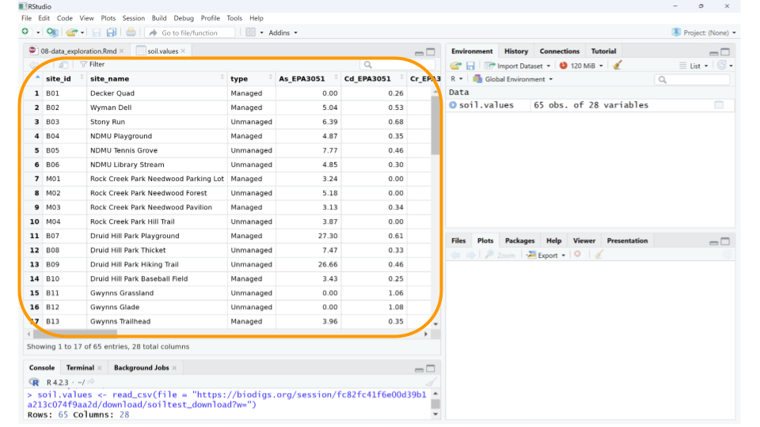
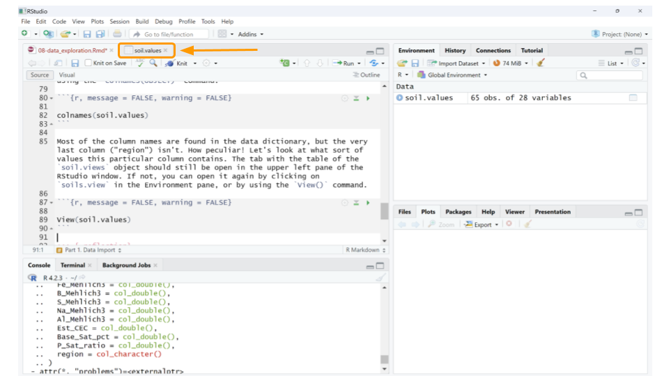

# (PART\*) Data Exploration {-}


```{r, include = FALSE}
ottrpal::set_knitr_image_path()
```

# Exploring Soil Testing Data With R

In this activity, you'll have a chance to become familiar with the BioDIGS soil testing data. This dataset includes information on the inorganic components of each soil sample, particularly metal concentrations. Human activity can increase the concentration of inorganic compounds in the soil. When cars drive on roads, compounds from the exhaust, oil, and other fluids might settle onto the roads and be washed into the soil. When we put salt on roads, parking lots, and sidewalks, the salts themselves will eventually be washed away and enter the ecosystem through both water and soil. Chemicals from factories and other businesses also leech into our environment. All of this means the concentration of heavy metals and other chemicals will vary among the soil samples collected for the BioDIGS project. 

## Before You Start

```{r, echo = FALSE, results='asis'}
cow::borrow_chapter(
  doc_path = "child/_child_google_create_account.Rmd",
  repo_name = "jhudsl/AnVIL_Template"
)
```

## Objectives

This activity will teach you how to use the AnVIL platform to:

1. Import data into RStudio
1. Examine a csv file that contains the soil testing data from the BioDIGS project
1. Calculate summary statistics for variables in the soil testing data
1. Create and interpret histograms and boxplots for variables in the soil testing data


## Part 1. Data Import

We will use the `BioDIGS` package to retrieve the data. We first need to install the package from where it is stored on GitHub.

```{r, message = FALSE, warning = FALSE, echo = FALSE}

library(readr)
soil.values <- read_csv(file = "soil_testing_data.csv")
```


```{r, message = FALSE, warning = FALSE, eval=F}

devtools::install_github("fhdsl/BioDIGSData")
```

Once you've installed the package, we can load the library and assign the soil testing data to an _object_. This command follows the code structure:

dataset_object_name <- stored_BioDIGS_dataset

```{r, message = FALSE, warning = FALSE, eval=F}

library(BioDIGSData)

soil.values <- BioDIGS_soil_data()
```

It _seems_ like the dataset loaded, but it's always a good idea to verify. There are many ways to check, but the easiest approach (if you're using RStudio) is to look at the Environment tab on the upper right-hand side of the screen. You should now have an object called `soil.values` that includes some number of observations for 28 variables. The _observations_ refer to the number of rows in the dataset, while the _variables_ tell you the number of columns. As long as neither the observations or variables are 0, you can be confident that your dataset loaded.

Let's take a quick look at the dataset. We can do this by clicking on soil.values object in the Environment tab. (Note: this is equivalent to typing `View(soil.values)` in the R console.)


This will open a new window for us to scroll through the dataset.



Well, the data definitely loaded, but those column names aren't immediately understandable. What could **As_EPA3051** possibly mean? In addition to the dataset, we need to load the _data dictionary_ as well.

:::{.dictionary}

**Data dictionary:** a file containing the names, definitions, and attributes about data in a database or dataset.

:::

In this case, the data dictionary can help us make sense of what sort of values each column represents. The data dictionary for the BioDIGS soil testing data is available in the R package (see code below), but we have also reproduced it here.

```{r, message = FALSE, warning = FALSE, eval=FALSE}

?BioDIGS_soil_data()
```

:::{.dictionary}

- **site_id** Unique letter and number site name
- **full_name** Full site name
- **As_EPA3051** Arsenic (mg/kg), EPA Method 3051A. Quantities < 3.0 are not detectable.
- **Cd_EPA3051** Cadmium (mg/kg), EPA Method 3051A. Quantities < 0.2 are not detectable.
- **Cr_EPA3051** Chromium (mg/kg), EPA Method 3051A
- **Cu_EPA3051** Copper (mg/kg), EPA Method 3051A
- **Ni_EPA3051** Nickel (mg/kg), EPA Method 3051A
- **Pb_EPA3051** Lead (mg/kg), EPA Method 3051A
- **Zn_EPA3051** Zinc (mg/kg), EPA Method 3051A
- **water_pH**
- **A-E_Buffer_pH**
- **OM_by_LOI_pct** Organic Matter by Loss on Ignition
- **P_Mehlich3** Phosphorus (mg/kg), using the Mehlich 3 soil test extractant
- **K_Mehlich3 Potassium** (mg/kg), using the Mehlich 3 soil test extractant
- **Ca_Mehlich3** Calcium (mg/kg), using the Mehlich 3 soil test extractant
- **Mg_Mehlich3** Magnesium (mg/kg), using the Mehlich 3 soil test extractant
- **Mn_Mehlich3** Manganese (mg/kg), using the Mehlich 3 soil test extractant
- **Zn_Mehlich3** Zinc (mg/kg), using the Mehlich 3 soil test extractant
- **Cu_Mehlich3** Copper (mg/kg), using the Mehlich 3 soil test extractant
- **Fe_Mehlich3** Iron (mg/kg), using the Mehlich 3 soil test extractant
- **B_Mehlich3** Boron (mg/kg), using the Mehlich 3 soil test extractant
- **S_Mehlich3** Sulfur (mg/kg), using the Mehlich 3 soil test extractant
- **Na_Mehlich3** Sodium (mg/kg), using the Mehlich 3 soil test extractant
- **Al_Mehlich3** Aluminum (mg/kg), using the Mehlich 3 soil test extractant
- **Est_CEC** Cation Exchange Capacity (meq/100g) at pH 7.0 (CEC)
- **Base_Sat_pct** Base saturation (BS). This represents the percentage of CEC occupied by bases (Ca2+, Mg2+, K+, and Na+). The %BS increases with increasing soil pH. The availability of Ca2+, Mg2+, and K+ increases with increasing %BS.
- **P_Sat_ratio** Phosphorus saturation ratio. This is the ratio between the amount of phosphorus present in the soil and the total capacity of that soil to retain phosphorus. The ability of phosphorus to be bound in the soil is primary a function of iron (Fe) and aluminum (Al) content in that soil.

:::

Using the data dictionary, we find that the values in column `As_EPA3051` give us the arsenic concentration in mg/kg of each soil sample, as determined by EPA Method 3051A. While arsenic can occur naturally in soils, higher levels suggest the soil may have been contaminated by mining, hazardous waste, or pesticide application. Arsenic is toxic to humans.

We can also look at just the names of all the columns using the R console using the `colnames()` command.

```{r, message = FALSE, warning = FALSE}

colnames(soil.values)
```

Most of the column names are found in the data dictionary, but the very last column ("region") isn't. How peculiar! Let's look at what sort of values this particular column contains. The tab with the table of the `soil.views` object should still be open in the upper left pane of the RStudio window. If not, you can open it again by clicking on  `soils.view` in the Environment pane, or by using the `View()` command.

```{r, message = FALSE, warning = FALSE, eval = F}

View(soil.values)
```




If you scroll to the end of the table, we can see that "region" seems to refer to the city or area where the samples were collected. For example, the first 24 samples all come from Baltimore City.


You may notice that some cells in the `soil.values` table contain _NA_. This just means that the soil testing data for that sample isn't available yet. We'll take care of those values in the next part.

::: {.reflection}
QUESTIONS:

1. How many observations are in the soil testing values dataset that you loaded? What do each of these observations refer to?

2. What data is found in the column labeled "Fe_Mehlich3"? Why would we be interested how much of this is in the soil? (You may have to search the internet for this answer.)

:::

## Part 2. Data Summarization

Now that we have the dataset loaded, let's explore the data in more depth.

First, we should remove those samples that don't have soil testing data yet. We _could_ keep them in the dataset, but removing them at this stage will make the analysis a little cleaner. In this case, as we know the reason the data are missing (and that reason will not skew our analysis), we can safely remove these samples. This will not be the case for every data analysis.

We can remove the unanalyzed samples using the `drop_na()` function from the `tidyr` package. This function removes any rows from a table that contains _NA_ for a particular column. This command follows the code structure:

dataset_new_name <- dataset %>% drop_na(column_name)

The `%>% is called a pipe and it tells R that the commands after it should all be applied to the object in front of it. (In this case, we can filter out all samples missing a value for "As_EPA3051" as a proxy for samples without soil testing data.)

```{r, message = FALSE, warning = FALSE}

library(tidyr)

soil.values.clean <- soil.values %>% drop_na(As_EPA3051)
```

Great! Now let's calculate some basic statistics. For example, we might want to know what the mean (average) lead concentration is for each soil sample. According to the data dictionary, the values for lead concentration are in the column labeled "Pb_EPA3051". We can use a combination of two functions: `pull()` and `mean()`.`pull()` lets you extract a column from your table for statistical analysis, while `mean()` calculates the average value for the extracted column.

This command follows the code structure:

OBJECT %>% pull(column_name) %>% mean()

`pull()` is a command from the `tidyverse` package, so we'll need to load that library before our command.

```{r, message = FALSE, warning = FALSE}

library(tidyverse)

soil.values.clean %>% pull(As_EPA3051) %>% mean()
```

We can run similar commands to calculate the standard deviation, minimum, and maximum for the soil arsenic values.

```{r, message = FALSE, warning = FALSE}

soil.values.clean %>% pull(As_EPA3051) %>% sd()
soil.values.clean %>% pull(As_EPA3051) %>% min()
soil.values.clean %>% pull(As_EPA3051) %>% max()
```
As you can see, the standard deviation of the arsenic concentrations is listed first, then the minimum concentration, and finally the maximum concentration.

The soil testing dataset contains samples from multiple geographic regions, so maybe it's more meaningful to find out what the average arsenic values are for each region. We have to do a little bit of clever coding trickery for this using the `group_by` and `summarize` functions. First, we tell R to split our dataset up by a particular column (in this case, region) using the `group_by` function, then we tell R to summarize the mean arsenic concentration for each group. Because there are several different functions with the name `summarize` in R, we have to specify that we want to use `summarize` from the `dplyr` package. This command follows the code structure:

dataset %>%
    group_by(column_name) %>%
    dplyr::summarize(Mean = mean(column_name))
    
```{r, message = FALSE, warning = FALSE}

soil.values.clean %>%
    group_by(region) %>%
    dplyr::summarize(Mean = mean(As_EPA3051))
```

Now we know that the mean arsenic concentration might be different for each region, and appears higher for the Baltimore City samples than the Montgomery County samples.

::: {.reflection}
QUESTIONS:

3. What is the mean iron concentration for samples in this dataset? What about the standard deviation, minimum value, and maximum value?

2. Calculate the mean iron concentration by region. Which region has the highest mean iron concentration? What about the lowest?

:::

## Part 3. Data Visualization

Often, it can be easier to immediately interpret data displayed as a plot than as a list of values. For example, we can more easily understand how the arsenic concentration of the soil samples are distributed if we create histograms compared to looking at point values like mean, standard deviation, minimum, and maximum.

One way to make histograms in R is to use the `hist()` function. We can again use the `pull()` command and pipes (`%>%`) to choose the column we want from the `soil.values.clean` dataset and make a histogram of them. Remember, this command follows the code structure:

dataset %>%
    pull(column_name) %>%
    hist(main = chart_title, xlab = x_axis_title)

In this case, we do _not_ have to use the `dplyr::summarize` command before `hist()` because there's only one function called `hist()` in the packages we're using.

```{r, message = FALSE, warning = FALSE}

soil.values.clean %>% 
    pull(As_EPA3051) %>% 
    hist(main = 'Histogram of Arsenic Concentration', 
         xlab ='Concentration in mg/kg' )
```

We can see that almost all the soil samples had very low concentrations of arsenic (which is good news for the soil health!). In fact, many of them had arsenic concentrations close to 0, and only one sampling location appears to have high levels of arsenic. 

We might also want to graphically compare arsenic concentrations among the geographic regions in our dataset. We can do this by creating boxplots. Boxplots are particularly useful when comparing the mean, variation, and distributions among multiple groups. In R, one way to create a boxplot is using the `boxplot()` function. We don't need to use pipes for this command, but instead will specify what columns we want to use from the dataset inside the `boxplot()` function itself.

This command follows the code structure:

boxplot(arsenic_concentration ~ grouping_variable, 
    data = dataset,
    main = "Title of Graph",
    xlab = "x_axis_title",
    ylab = "y_axis_title")

```{r, message = FALSE, warning = FALSE}
boxplot(As_EPA3051 ~ region, data = soil.values.clean,
        main = "Arsenic Concentration by Geographic Region",
        xlab = "Region",
        ylab = "Arsenic Concentration in mg/kg")
```

By using a boxplot, we can quickly see that, while one sampling site within Baltimore City has a very high concentration of arsenic in the soil, in general there isn't a difference in arsenic content between Baltimore City and Montgomery County.

::: {.reflection}
QUESTIONS:

5. Create a histogram for _iron_ concentration, as well as a boxplot comparing iron concentration by region. Is the iron concentration similar among regions? Are there any outlier sites with unusually high or low iron concentrations?

6. Create a histogram for _lead_ concentration, as well as a boxplot comparing lead concentration by region. Is the lead concentration similar among regions? Are there any outlier sites with unusually high or low lead concentrations?

7. Look at the maps for [iron](https://biodigs.org/#iron_map) and [lead](https://biodigs.org/#lead_map) on the BioDIGS website. Do the boxplots you created make sense, given what you see on these maps? Why or why not?

:::
